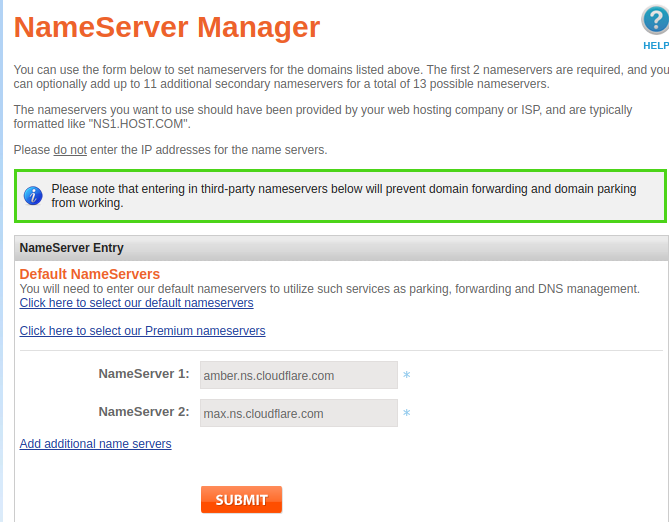

# V2Ray for Ansible

本 Playbook 将利用 Ansible 在服务器上自动化部署 V2Ray。目前，仅在 Debian
GNU/Linux 10 上测试通过。Debian GNU/Linux 更低版本或 Ubuntu 系列大概也没有问题

使用本仓库请自行承担风险。

根据 V2Ray 大多数用户推荐，本 Playbook 采用 [WebSocket+TLS+Web](https://toutyrater.github.io/advanced/wss_and_web.html) 部署方式。换句话说，它将在服务器上安装下列软件：

* acme：用于请求 SSL 证书
* NGINX：用于提供 Web 服务
* V2Ray :   代理服务器

## 使用要求

为了正常使用 V2Ray，应当满足以下要求：

* 一台云主机，如[搬瓦工](https://bwh88.net/aff.php?aff=43530&pid=57)优惠码：`BWH3HYATVBJW`、 [Vultr](https://www.vultr.com/?ref=7123175)、[Linode](https://www.linode.com/?r=28bf53dae49d2c55dd671136769c0b7526db5891)、[DO](https://m.do.co/c/7758457f61ad) 等等。
* 一个域名且已经绑定到云主机。
* Ansible，可参考[官方文档](https://docs.ansible.com/ansible/latest/installation_guide/intro_installation.html#installing-the-control-node)安装。

## 注册域名

可以到[namesilo](https://www.namesilo.com/)注册一个域名

参考: https://zhuanlan.zhihu.com/p/25627048

## 注册 cloudflare

https://dash.cloudflare.com/login

著名的CDN,可以用来管理我们的域名解析. 

参考: https://zhuanlan.zhihu.com/p/82909515

## 转移域名解析到cloudflare

登录namesilo,转到 `domain manager `页面, 选择你的域名, 点击 `change nameserver`, 将域名解析 转移到 cloudflare:

nameserver如图填写即可.

| 类型 | 值                      |
| :--- | :---------------------- |
| NS   | amber.ns.cloudflare.com |
| NS   | max.ns.cloudflare.com   |



参考: https://linuxword.com/?p=8080

## 开通一个自己的vps虚拟主机

一台云主机，如[搬瓦工](https://bwh88.net/aff.php?aff=43530&pid=57)优惠码：`BWH3HYATVBJW`、 [Vultr](https://www.vultr.com/?ref=7123175)、[Linode](https://www.linode.com/?r=28bf53dae49d2c55dd671136769c0b7526db5891)、[DO](https://m.do.co/c/7758457f61ad) 等等。

推荐[搬瓦工](https://bwh88.net/aff.php?aff=43530&pid=57), CN2速度快.

系统可以选择 debian11,安装完成后,会发送帐号密码到你的电子邮箱


请使用ssh远程链接,并设置好使用ssh公钥登陆,最好修改一下ssh登陆的端口号( 往下看,已经配置 new_ssh_port)

参考: https://wangdoc.com/ssh/key.html

```bash
ssh-copy-id root@主机ip -p ssh端口号
```

## 域名设置

进入cloudflare管理界面,设置域名到ip的映射

添加记录-->类型:A --> 名称: 子域名的前缀,例如 blog.sohu.com的子域名就填写 blog --> 内容: 你的主机ip地址


另外一个常用的记录类型: CNAME, 就是 对一个域名 起一个 别称, 这里暂用不到.

参考: https://zhuanlan.zhihu.com/p/56423186

域名配置好后,请检查一下是否正常解析:

```bash
nslookup blog.sohu.com
```

## 安装代理软件

下载(git clone)此仓库代码到本地

按照你的实际情况,编辑**配置文件config**

```bash
server_ip="abc.xyz.com"
server_ssh_port=22
new_ssh_port=22
server_domain="abc.xyz.com"
email_addr="abc@gmail.com"

client_ip="127.0.0.1"
client_ssh_port=22
uuid="a0836f20-8888-28c1-c7c0-d49e7242b9f2"
```


### 安装服务端
`bash setup`

### 安装客户端
`bash v2ray_client`

安装完成后,代理地址已经打印出来,

其中会有一个二维码,后面手机客户端会用到

也有一个 配置用的`vmess link:`,windows客户端会用到


如果找不到,可以到你的vps主机的`/root`目录,打印出来即可.

```bash
cat v2ray.info
```

### 使用代理

#### linux环境变量

```bash
export proxy=http://$client_ip:8118
export http_proxy=$proxy
export https_proxy=$proxy
```

可以将这三行设置写入`$HOME/.bashrc` 或者 `"$HOME/.zshrc"`文件,普通用户和root用户都需要的.

#### windows客户端

https://github.com/2dust/v2rayN/releases

有两个包:

v2rayN.zip             v2rayN-Core.zip


先解压 v2rayN.zip


再解压v2rayN-Core.zip,把这个core解压出的文件夹下内容全部复制到 上面解压后的文件夹内.


然后使用v2rayN.zip解压后的文件夹内的主程序


打开后,添加 `vmess link`地址,并设置一下代理的端口号,一般默认是`1080`,可以用默认的.

#### Chrome浏览器

linux系统中, 先使用系统设置,开启全局代理

代理地址就是上面的 `http://$client_ip:8118`

然后打开chrome浏览器,打开商店 https://chrome.google.com/webstore/category/extensions

搜索 SwitchyOmega  并安装

配置的话, 请参考: https://blog.csdn.net/ccc369639963/article/details/123421677


windows系统, 上面的v2rayN软件有开启系统代理的功能.


#### Android手机客户端

https://github.com/2dust/v2rayNG/releases

apk程序下载安装,打开程序,扫描二维码添加.

#### 苹果手机客户端

比较麻烦,请忽略.

### 注意事项

- 域名到期前续费
- v2ray和https签名证书定期更新(服务器端)

此项目有一个脚本可用: update-v2ray.sh  就是用来升级服务器端的

